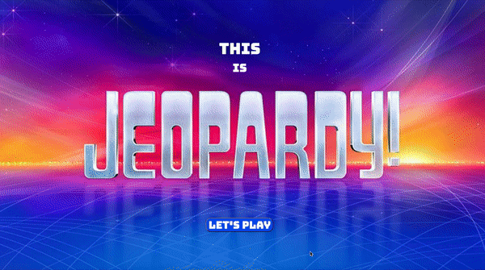

# JEOPARDY 

THE GAME MAINLY WORKS HOW JEOPARDY WORKS. THE MAIN DIFFERENCE IS THE DAILY DOUBLE JUST DOUBLES THE SCORE FOR THAT CURRENT QUESTION INSTEAD OF ALLOWING THE PLAYER TO BET. IF THEY PICK A QUESTION FOR $500 THEN THAT MEANS THEY WOULD EITHER GET $1000 OR LOSE $1000 DEPENDING ON IF THEY ANSWER CORRECTLY.

The game also relies on the honor system. Answer the question out loud, then view the answer. Next choose whether you were correct or incorrect and move on to the next question.

### Preview

This game was created as a training tool to be played by a trainee and controlled by the trainer. It is free to copy and insert any questions and answers you would like.
